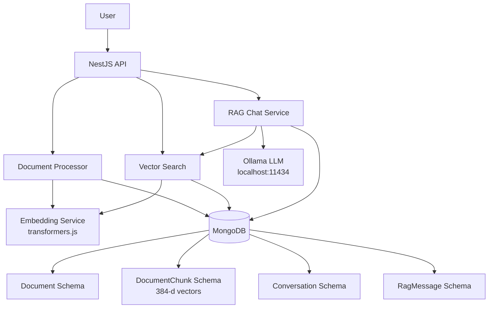
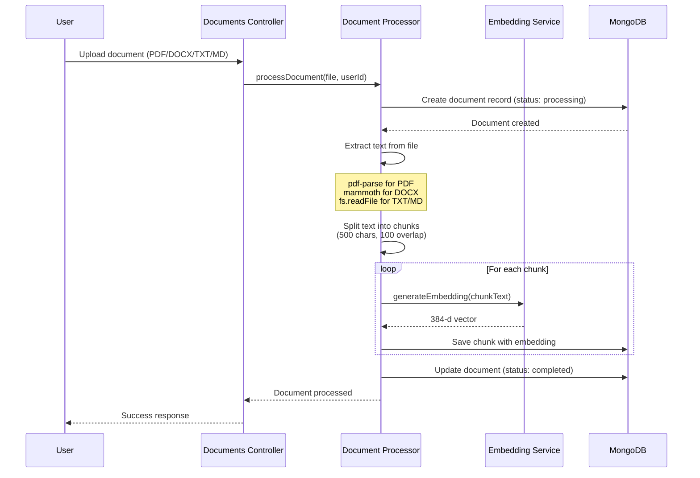
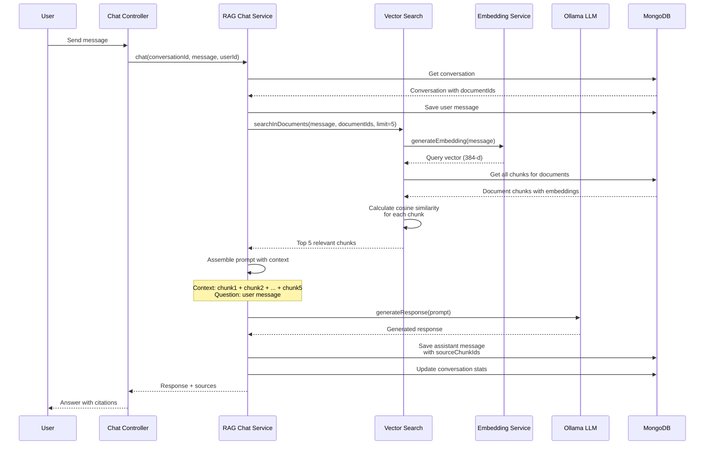
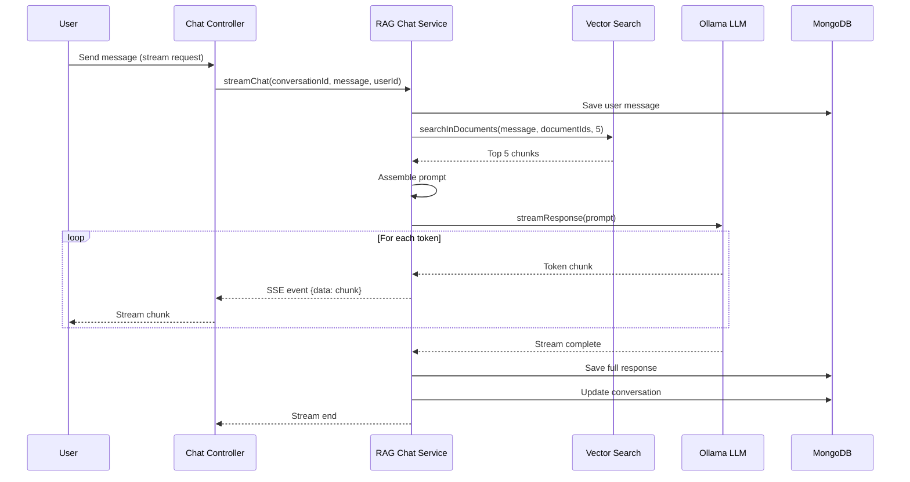

# RAG System Flow Documentation

## System Architecture Overview



---

## Flow 1: Document Upload & Processing

### API Endpoint

```
POST /documents
Authorization: Bearer <token>
Content-Type: multipart/form-data

Body: { file: <PDF|DOCX|TXT|MD> }
```

### Sequence Diagram



### Step-by-Step Process

1. **File Upload**
   - User uploads file via multipart/form-data
   - Multer saves file to `./uploads` directory
   - File validated for supported types

2. **Document Record Creation**
   - Document schema entry created with status "processing"
   - Metadata stored: filename, fileType, fileSize, filePath

3. **Text Extraction**
   - **PDF**: `pdf-parse` extracts text from buffer
   - **DOCX**: `mammoth.extractRawText()` extracts text
   - **TXT/MD**: Direct file read as UTF-8

4. **Text Chunking**
   - Text split into 500-character chunks
   - 100-character overlap between chunks
   - Empty chunks filtered out

5. **Embedding Generation**
   - Each chunk sent to `EmbeddingService`
   - `all-MiniLM-L6-v2` model generates 384-d vector
   - Runs locally via `@xenova/transformers`

6. **Chunk Storage**
   - Each chunk saved to `DocumentChunk` collection
   - Includes: content, embedding, chunkIndex, tokenCount
   - Linked to document via `documentId`

7. **Status Update**
   - Document status updated to "completed"
   - `totalChunks` field updated
   - Ready for RAG queries

---

## Flow 2: RAG Chat (Standard)

### API Endpoint

```
POST /chat
Authorization: Bearer <token>
Content-Type: application/json

Body: {
  "conversationId": "507f1f77bcf86cd799439011",
  "message": "What is the main topic?"
}
```

### Sequence Diagram



### Step-by-Step Process

1. **Message Reception**
   - User sends message with conversationId
   - Conversation validated and retrieved

2. **User Message Storage**
   - Message saved to `RagMessage` collection
   - Role: "user", linked to conversation

3. **Context Retrieval**
   - Query embedding generated from user message
   - Vector search finds top 5 similar chunks
   - Cosine similarity calculated: `dot(a,b) / (||a|| * ||b||)`

4. **Prompt Assembly**

   ```
   You are a helpful assistant. Use the following context...

   Context:
   [chunk1 content]
   [chunk2 content]
   ...

   User Question: [user message]

   Answer:
   ```

5. **LLM Generation**
   - Prompt sent to Ollama (localhost:11434)
   - Model generates response based on context
   - Response returned as complete text

6. **Response Storage**
   - Assistant message saved with response
   - `sourceChunkIds` array stores which chunks were used
   - Metadata includes retrieval scores

7. **Conversation Update**
   - `messageCount` incremented by 2
   - `lastMessageAt` timestamp updated

---

## Flow 3: RAG Chat (Streaming)

### API Endpoint

```
POST /chat/stream
Authorization: Bearer <token>
Content-Type: application/json

Body: {
  "conversationId": "507f1f77bcf86cd799439011",
  "message": "Summarize the document"
}
```

### Sequence Diagram



### Step-by-Step Process

1. **Stream Initialization**
   - SSE (Server-Sent Events) connection established
   - Observable created for streaming

2. **Context Retrieval** (same as standard)
   - Vector search for relevant chunks
   - Prompt assembled with context

3. **Streaming Generation**
   - Ollama API called with `stream: true`
   - Response reader processes chunks line-by-line
   - Each token emitted as SSE event

4. **Real-time Delivery**
   - User receives tokens as they're generated
   - No waiting for complete response
   - Better UX for long responses

5. **Post-stream Storage**
   - Full response accumulated during streaming
   - Saved to database after completion
   - Same metadata as standard chat

---

## Flow 4: Conversation Management

### Create Conversation

```
POST /chat/conversations
Body: {
  "title": "Research Chat",
  "documentIds": ["doc1", "doc2"]
}
```

**Process:**

1. Conversation record created
2. Optional document IDs linked
3. Initial messageCount = 0
4. Returns conversation ID

### List Conversations

```
GET /chat/conversations
```

**Process:**

1. Query all conversations for user
2. Sort by `updatedAt` descending
3. Return list with metadata

### Get Messages

```
GET /chat/conversations/:id/messages
```

**Process:**

1. Validate conversation ownership
2. Query messages sorted by `createdAt`
3. Populate `sourceChunkIds` for citations
4. Return full conversation history

---

## Data Flow Summary

### Document → Embeddings

```
PDF/DOCX/TXT/MD
  ↓ (text extraction)
Raw Text
  ↓ (chunking: 500 chars, 100 overlap)
Text Chunks[]
  ↓ (embedding: all-MiniLM-L6-v2)
384-d Vectors[]
  ↓ (storage)
MongoDB DocumentChunk Collection
```

### Query → Response

```
User Question
  ↓ (embedding)
Query Vector (384-d)
  ↓ (cosine similarity search)
Top 5 Relevant Chunks
  ↓ (context assembly)
Prompt with Context
  ↓ (Ollama LLM)
Generated Response
  ↓ (storage + return)
User receives answer + sources
```

---

## Key Technical Details

### Vector Search Algorithm

```typescript
cosineSimilarity(a, b) =
  dotProduct(a, b) / (norm(a) * norm(b))

where:
  dotProduct = Σ(a[i] * b[i])
  norm(a) = √(Σ(a[i]²))
```

### Chunking Strategy

- **Size**: 500 characters
- **Overlap**: 100 characters
- **Rationale**: Balance between context and granularity
- **Example**:
  ```
  Chunk 1: chars 0-500
  Chunk 2: chars 400-900  (100 char overlap)
  Chunk 3: chars 800-1300 (100 char overlap)
  ```

### Embedding Model

- **Model**: `Xenova/all-MiniLM-L6-v2`
- **Dimensions**: 384
- **Runtime**: Node.js (via transformers.js)
- **Speed**: ~50ms per embedding (local)

### LLM Integration

- **Service**: Ollama
- **Default Model**: llama3.2
- **Endpoint**: http://localhost:11434
- **Modes**: Standard + Streaming

---

## Error Handling

### Document Processing Errors

- File extraction fails → status: "failed", errorMessage stored
- Embedding generation fails → retry or mark failed
- Invalid file type → rejected at upload

### Chat Errors

- Conversation not found → 404 error
- No documents in conversation → search all user chunks
- Ollama unavailable → error returned to user
- Empty context → LLM responds with "no relevant information"

---

## Performance Considerations

### Optimization Points

1. **Batch Embedding**: Process multiple chunks in parallel
2. **Vector Index**: MongoDB indexes on embedding field
3. **Chunk Caching**: Cache frequently accessed chunks
4. **Streaming**: Reduce perceived latency for long responses

### Scalability

- **Documents**: Unlimited per user
- **Chunks**: ~2 chunks per 1000 characters
- **Conversations**: Unlimited
- **Messages**: Full history retained
