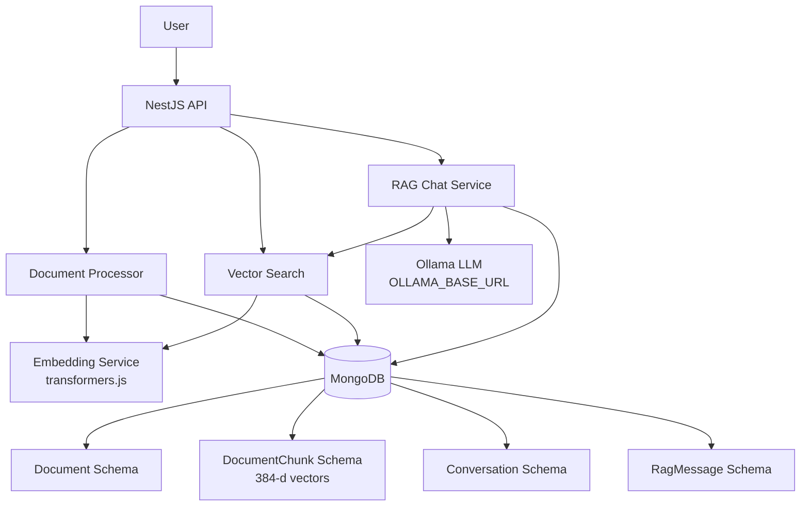
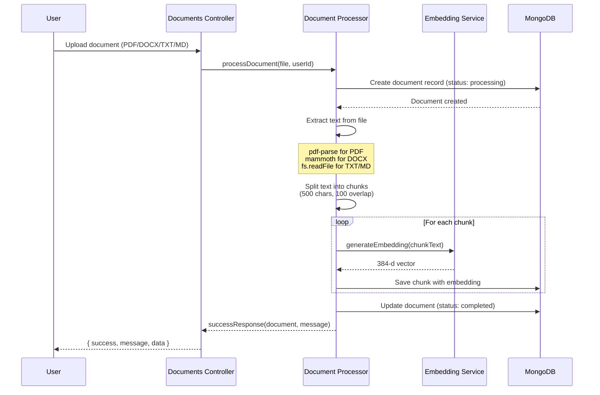
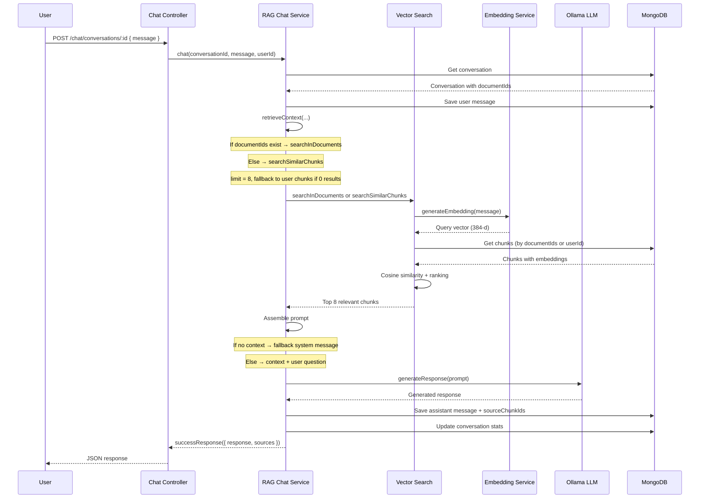
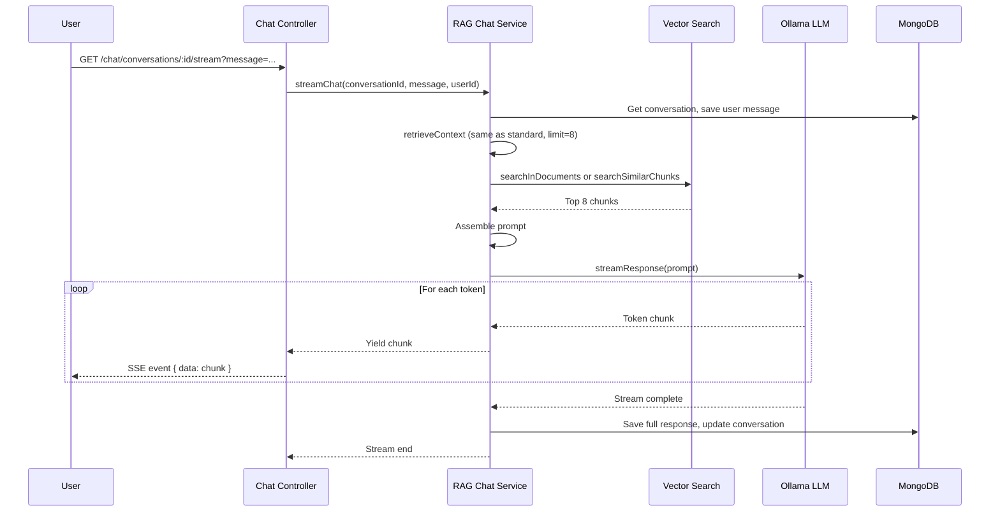

# RAG System Flow Documentation

## System Architecture Overview



---

## Flow 1: Document Upload & Processing

### API Endpoints

**Upload document**

```
POST /documents
Authorization: Bearer <token>
Content-Type: multipart/form-data

Body: { file: <PDF|DOCX|TXT|MD> }
```

**Get my documents (paginated)**

```
GET /documents?page=1&limit=10
Authorization: Bearer <token>
```

Returns paginated list of the user's uploaded documents with metadata (page, limit, total, totalPage).

**Delete document**

```
DELETE /documents/:id
Authorization: Bearer <token>
```

### Sequence Diagram



### Step-by-Step Process

1. **File Upload**
   - User uploads file via multipart/form-data
   - Multer saves file to `./uploads` directory
   - File validated for supported types

2. **Document Record Creation**
   - Document schema entry created with status "processing"
   - Metadata stored: filename, fileType, fileSize, filePath

3. **Text Extraction**
   - **PDF**: `pdf-parse` extracts text from buffer
   - **DOCX**: `mammoth.extractRawText()` extracts text
   - **TXT/MD**: Direct file read as UTF-8

4. **Text Chunking**
   - Text split into 500-character chunks
   - 100-character overlap between chunks
   - Empty chunks filtered out

5. **Embedding Generation**
   - Each chunk sent to `EmbeddingService`
   - `all-MiniLM-L6-v2` model generates 384-d vector
   - Runs locally via `@huggingface/transformers`

6. **Chunk Storage**
   - Each chunk saved to `DocumentChunk` collection
   - Includes: content, embedding, chunkIndex, tokenCount
   - Linked to document via `documentId`

7. **Status Update**
   - Document status updated to "completed"
   - `totalChunks` field updated
   - Ready for RAG queries

---

## Flow 2: RAG Chat (Standard)

### API Endpoint

Conversation ID is in the path; message is in the body.

```
POST /chat/conversations/:id
Authorization: Bearer <token>
Content-Type: application/json

Body: {
  "message": "What is the main topic?"
}
```

### Sequence Diagram



### Step-by-Step Process

1. **Message Reception**
   - User sends message to `POST /chat/conversations/:id` with body `{ "message": "..." }`
   - Conversation ID in path; conversation validated and retrieved

2. **User Message Storage**
   - Message saved to `RagMessage` collection
   - Role: "user", linked to conversation

3. **Context Retrieval (retrieveContext)**
   - If conversation has `documentIds`: `searchInDocuments(message, documentIds, 8)` (chunks scoped to those documents, using ObjectIds)
   - Else: `searchSimilarChunks(message, userId, 8)` (all user chunks)
   - If document-scoped search returns 0 chunks: fallback to `searchSimilarChunks` for the user
   - Query embedding from user message; cosine similarity; top 8 chunks returned

4. **Prompt Assembly**
   - If context is empty: prompt states "No relevant passages were found in the user's uploaded documents" and instructs the model to say so
   - Otherwise: context from chunks + user question; model instructed to answer from context or say nothing relevant

5. **LLM Generation**
   - Prompt sent to Ollama (`OLLAMA_BASE_URL`, e.g. http://ollama:11434 in Docker)
   - Model generates response; returned as complete text

6. **Response Storage**
   - Assistant message saved with response, `sourceChunkIds`, retrieval scores

7. **Conversation Update**
   - `messageCount` incremented by 2, `lastMessageAt` updated

8. **API Response**
   - Controller returns service result: `successResponse({ response, sources })` with no extra wrapping

---

## Flow 3: RAG Chat (Streaming)

### API Endpoint

SSE endpoint: conversation ID in path, message as query parameter (GET).

```
GET /chat/conversations/:id/stream?message=Summarize%20the%20document
Authorization: Bearer <token>
Accept: text/event-stream
```

### Sequence Diagram



### Step-by-Step Process

1. **Stream Initialization**
   - Client opens GET to `/chat/conversations/:id/stream?message=...`
   - SSE (Server-Sent Events) connection; Observable streams chunks

2. **Context Retrieval** (same as standard chat)
   - `retrieveContext`: document-scoped or user-wide, limit 8, fallback if 0
   - Prompt assembled with context (or "no relevant passages" when empty)

3. **Streaming Generation**
   - Ollama API called with `stream: true`
   - Each token yielded and sent as SSE event

4. **Real-time Delivery**
   - User receives tokens as they're generated
   - No waiting for full response

5. **Post-stream Storage**
   - Full response accumulated and saved with sourceChunkIds
   - Conversation stats updated

---

## Flow 4: Conversation Management

### Create Conversation

```
POST /chat/conversations
Content-Type: application/json
Body: {
  "title": "Research Chat",
  "documentIds": ["docId1", "docId2"]   // optional
}
```

**Process:**

1. Conversation record created with `userId`, `title`, `documentIds` (ObjectIds)
2. Optional document IDs scope subsequent RAG search to those documents
3. Initial messageCount = 0
4. Returns `successResponse(conversation, 'Conversation created')` (service builds response; controller returns it)

### List Conversations (paginated)

```
GET /chat/conversations?page=1&limit=10
```

**Process:**

1. Query conversations for user with pagination (skip, limit)
2. Sort by `updatedAt` descending
3. Return `successPaginatedResponse(data, { page, limit, total }, message)` with metadata (totalPage, etc.)

### Get Messages

```
GET /chat/conversations/:id/messages
```

**Process:**

1. Validate conversation ownership (conversationId + userId, ObjectIds)
2. Query messages for conversation, sorted by `createdAt`
3. Populate `sourceChunkIds` for citations
4. Return `successResponse(messages, 'Messages retrieved')`

---

## Data Flow Summary

### Document → Embeddings

```
PDF/DOCX/TXT/MD
  ↓ (text extraction)
Raw Text
  ↓ (chunking: 500 chars, 100 overlap)
Text Chunks[]
  ↓ (embedding: all-MiniLM-L6-v2)
384-d Vectors[]
  ↓ (storage)
MongoDB DocumentChunk Collection
```

### Query → Response

```
User Question
  ↓ (embedding)
Query Vector (384-d)
  ↓ (retrieveContext: document-scoped or user-wide, ObjectIds)
  ↓ (cosine similarity, top 8; fallback to user chunks if 0)
Top 8 Relevant Chunks
  ↓ (context assembly; empty → "No relevant passages" in prompt)
Prompt with Context
  ↓ (Ollama LLM, OLLAMA_BASE_URL)
Generated Response
  ↓ (storage + successResponse)
User receives { success, message, data: { response, sources } }
```

---

## Key Technical Details

### Vector Search

- **Document-scoped**: `searchInDocuments(query, documentIds, limit=8)` — chunks filtered by `documentId: { $in: objectIds }` (ObjectIds).
- **User-wide**: `searchSimilarChunks(query, userId, limit=8)` — chunks filtered by `userId: ObjectId(userId)`.
- **Cosine similarity**: `dotProduct(a, b) / (norm(a) * norm(b))`; sort by score descending; return top 8.
- **Debug**: VectorSearchService logs (debug level) query embedding, chunks found, and results.

### Chunking Strategy

- **Size**: 500 characters
- **Overlap**: 100 characters
- **Rationale**: Balance between context and granularity
- **Example**:
  ```
  Chunk 1: chars 0-500
  Chunk 2: chars 400-900  (100 char overlap)
  Chunk 3: chars 800-1300 (100 char overlap)
  ```

### Embedding Model

- **Model**: `Xenova/all-MiniLM-L6-v2`
- **Dimensions**: 384
- **Runtime**: Node.js (via transformers.js)
- **Speed**: ~50ms per embedding (local)

### LLM Integration

- **Service**: Ollama
- **Default Model**: `OLLAMA_MODEL` (e.g. llama3.2)
- **Base URL**: `OLLAMA_BASE_URL` (e.g. http://localhost:11434 locally; http://ollama:11434 in Docker)
- **Modes**: Standard (`generateResponse`) + Streaming (`streamResponse`)

---

## Error Handling

### Document Processing Errors

- File extraction fails → status: "failed", errorMessage stored
- Embedding generation fails → retry or mark failed
- Invalid file type → rejected at upload

### Chat Errors

- Conversation not found → 404 (AppError handled before generic "Database error")
- No documentIds on conversation → search all user chunks (`searchSimilarChunks`)
- Document-scoped search returns 0 → fallback to `searchSimilarChunks` for user
- Ollama unavailable (e.g. ECONNREFUSED) → error returned; log suggests checking OLLAMA_BASE_URL
- Empty context → Prompt tells LLM "No relevant passages were found"; model says so clearly

---

## Performance Considerations

### Optimization Points

1. **Batch Embedding**: Process multiple chunks in parallel
2. **Vector Index**: MongoDB indexes on embedding field
3. **Chunk Caching**: Cache frequently accessed chunks
4. **Streaming**: Reduce perceived latency for long responses

### Scalability

- **Documents**: Unlimited per user
- **Chunks**: ~2 chunks per 1000 characters
- **Conversations**: Unlimited
- **Messages**: Full history retained
