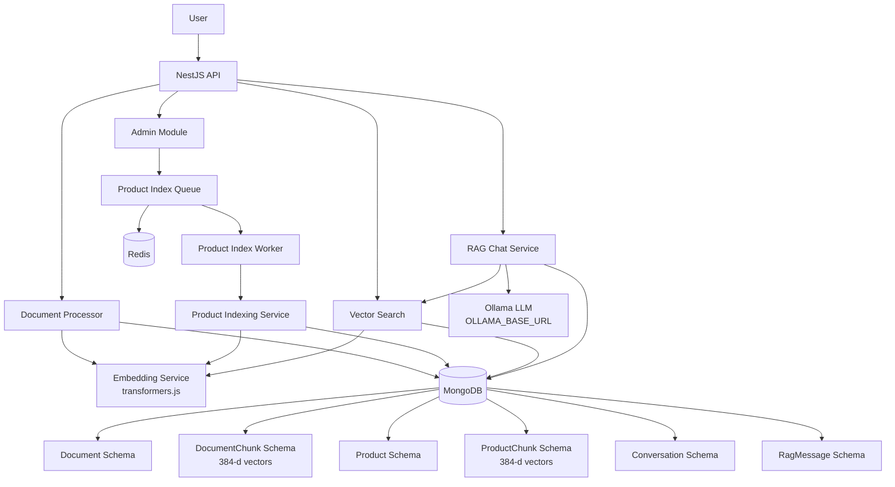
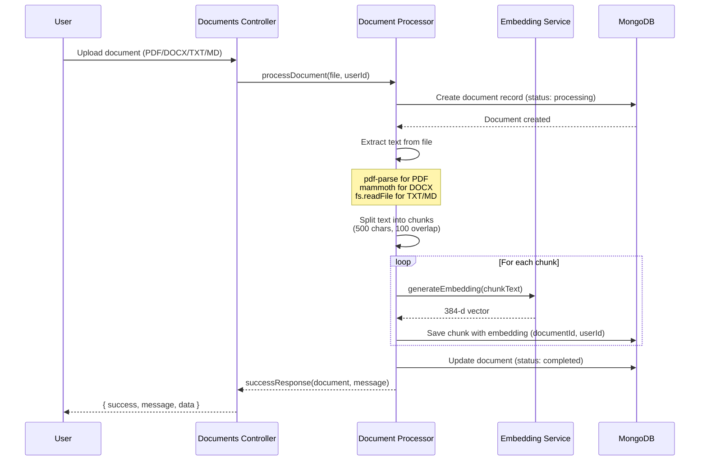
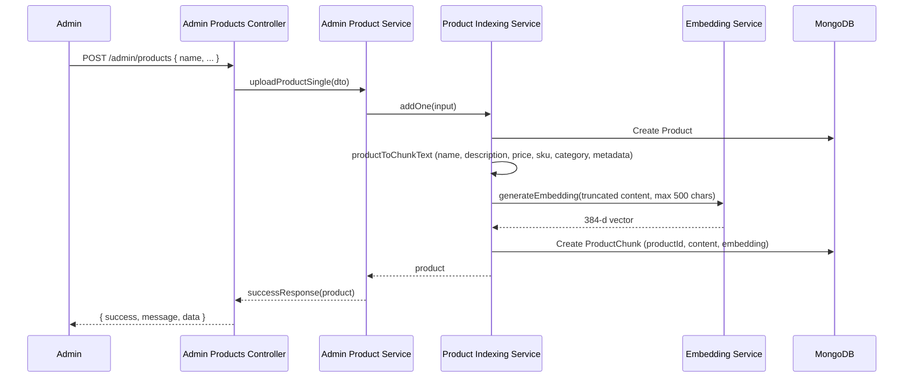
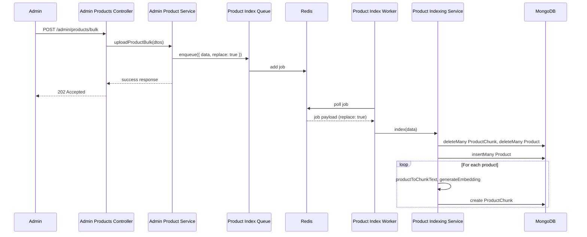
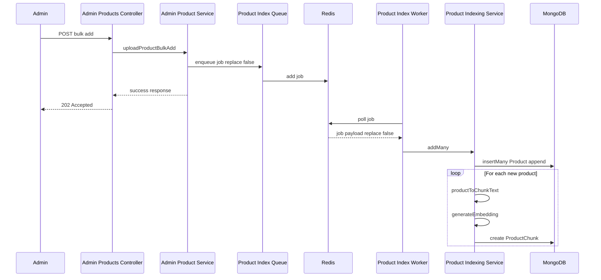
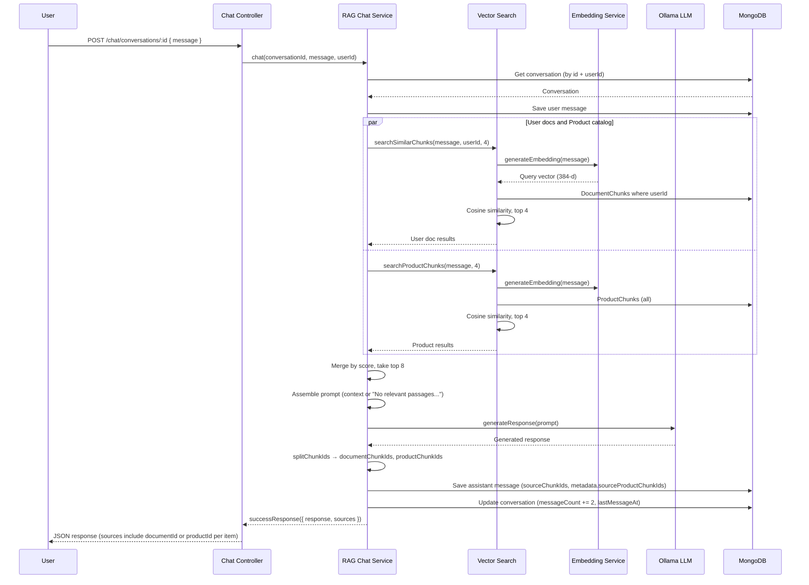
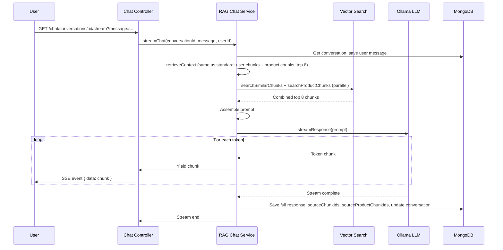

# RAG System Flow Documentation

## System Architecture Overview



---

## Flow 1: Document Upload & Processing

### API Endpoints

**Upload document**

```
POST /documents
Authorization: Bearer <token>
Content-Type: multipart/form-data

Body: { file: <PDF|DOCX|TXT|MD> }
```

**Get my documents (paginated)**

```
GET /documents?page=1&limit=10
Authorization: Bearer <token>
```

Returns paginated list of the user's uploaded documents with metadata (page, limit, total, totalPage).

**Delete document**

```
DELETE /documents/:id
Authorization: Bearer <token>
```

### Sequence Diagram



### Step-by-Step Process

1. **File Upload**
   - User uploads file via multipart/form-data
   - Multer saves file to `./uploads` directory
   - File validated for supported types

2. **Document Record Creation**
   - Document schema entry created with status "processing"
   - Metadata stored: filename, originalName, fileType, fileSize, filePath

3. **Text Extraction**
   - **PDF**: `pdf-parse` (PDFParse with Uint8Array buffer) extracts text
   - **DOCX**: `mammoth.extractRawText()` extracts text
   - **TXT/MD**: Direct file read as UTF-8

4. **Text Chunking**
   - Text split into 500-character chunks
   - 100-character overlap between chunks
   - Empty chunks filtered out

5. **Embedding Generation**
   - Each chunk sent to `EmbeddingService`
   - `all-MiniLM-L6-v2` model generates 384-d vector
   - Runs locally via `@huggingface/transformers`

6. **Chunk Storage**
   - Each chunk saved to `DocumentChunk` collection
   - Includes: content, embedding, chunkIndex, tokenCount, documentId, userId
   - Linked to document via `documentId`

7. **Status Update**
   - Document status updated to "completed"
   - `totalChunks` field updated
   - Ready for RAG queries

---

## Flow 2: Product Catalog & Indexing

The product catalog is a **global** index (no per-user scope). It is managed by **superadmin** only and powers semantic search in RAG chat alongside user documents.

### API Endpoints (Admin — superadmin only)

**Create a single product (sync)**

```
POST /admin/products
Authorization: Bearer <superadmin-token>
Content-Type: application/json

Body: { name, description?, price?, sku?, category?, imageUrl?, metadata? }
```

**Bulk replace catalog (async, queued)**

```
POST /admin/products/bulk
Authorization: Bearer <superadmin-token>
Content-Type: application/json

Body: { products: [ { name, description?, ... }, ... ] }
```

Replaces the **entire** product catalog with the payload: all existing products and chunks are removed, then the payload is indexed. Returns `202 Accepted` with message "Bulk replace accepted; indexing in progress".

**Bulk add products (async, queued)**

```
POST /admin/products/bulk/add
Authorization: Bearer <superadmin-token>
Content-Type: application/json

Body: { products: [ { name, description?, ... }, ... ] }
```

**Adds** the given products to the existing catalog; existing products and chunks are kept. Returns `202 Accepted` with message "Bulk add accepted; indexing in progress".

**List products (paginated)**

```
GET /admin/products?page=1&limit=10
Authorization: Bearer <superadmin-token>
```

### Sequence: Single product



### Sequence: Bulk replace (POST /admin/products/bulk)



### Sequence: Bulk add (POST /admin/products/bulk/add)



### Product indexing details

- **Single product**: `ProductIndexingService.addOne()` — creates one Product, one ProductChunk (content truncated to 500 chars), embedding generated synchronously. Used by `POST /admin/products`.
- **Replace entire catalog**: `ProductIndexingService.index(data)` — deletes all ProductChunks and Products, then inserts the payload and creates one chunk per product. Used by **`POST /admin/products/bulk`** (worker receives `replace: true`).
- **Add to existing catalog**: `ProductIndexingService.addMany(data)` — keeps all existing products and ProductChunks; inserts only the new products from the payload. Used by **`POST /admin/products/bulk/add`** (worker receives `replace: false`).
- **Queue**: BullMQ, queue name `QueueName.PRODUCT_INDEX`; worker concurrency 1. Job payload includes `data` and `replace`; worker calls `index(data)` when `replace === true`, else `addMany(data)`. Redis must be running for bulk endpoints.

---

## Flow 3: RAG Chat (Standard)

Context is retrieved from **two sources** in parallel: (1) the user’s document chunks, and (2) the global product catalog chunks. Results are merged by score and limited to 8 total (e.g. 4 per source). Conversations no longer have `documentIds`; every chat uses the same retrieval strategy.

### API Endpoint

```
POST /chat/conversations/:id
Authorization: Bearer <token>
Content-Type: application/json

Body: { "message": "What is the main topic?" }
```

### Sequence Diagram



### Step-by-Step Process

1. **Message Reception**
   - User sends message to `POST /chat/conversations/:id` with body `{ "message": "..." }`
   - Conversation ID in path; conversation validated by id + userId

2. **User Message Storage**
   - Message saved to `RagMessage` collection with role "user", linked to conversation

3. **Context Retrieval (retrieveContext)**
   - **User documents**: `searchSimilarChunks(message, userId, limitPerSource)` — DocumentChunks for that user; limit 4.
   - **Product catalog**: `searchProductChunks(message, limitPerSource)` — all ProductChunks; limit 4.
   - Both run in parallel. Results merged by score (desc), then sliced to `totalLimit` (8).
   - Query embedding from user message; cosine similarity in each collection.

4. **Prompt Assembly**
   - If context is empty: prompt states "No relevant passages were found in the user's documents or product catalog" and instructs the model to say so.
   - Otherwise: context from chunks + user question; model instructed to answer from context or say nothing relevant.

5. **LLM Generation**
   - Prompt sent to Ollama (`OLLAMA_BASE_URL`). Model generates response; returned as complete text.

6. **Response Storage**
   - Assistant message saved with response, `sourceChunkIds` (document chunk refs), and optionally `metadata.sourceProductChunkIds` (product chunk refs), plus retrieval scores.

7. **Conversation Update**
   - `messageCount` incremented by 2, `lastMessageAt` updated.

8. **API Response**
   - Controller returns `successResponse({ response, sources })`. Each source includes `content`, `score`, and either `documentId` or `productId`.

---

## Flow 4: RAG Chat (Streaming)

### API Endpoint

SSE endpoint: conversation ID in path, message as query parameter (GET).

```
GET /chat/conversations/:id/stream?message=Summarize%20the%20document
Authorization: Bearer <token>
Accept: text/event-stream
```

### Sequence Diagram



### Step-by-Step Process

1. **Stream Initialization**
   - Client opens GET to `/chat/conversations/:id/stream?message=...`
   - SSE (Server-Sent Events) connection; Observable streams chunks.

2. **Context Retrieval** (same as standard chat)
   - `retrieveContext`: parallel `searchSimilarChunks(userId)` and `searchProductChunks`, merge by score, top 8. Prompt assembled with context or "no relevant passages".

3. **Streaming Generation**
   - Ollama API called with `stream: true`; each token yielded and sent as SSE event.

4. **Post-stream Storage**
   - Full response accumulated and saved with sourceChunkIds and sourceProductChunkIds; conversation stats updated.

---

## Flow 5: Conversation Management

Conversations are **not** scoped to specific documents. They only have `userId`, `title`, `messageCount`, and `lastMessageAt`. RAG context is always: user’s document chunks + product catalog chunks.

### Create Conversation

```
POST /chat/conversations
Content-Type: application/json
Body: { "title": "Research Chat" }
Authorization: Bearer <token>
```

**Process:**

1. Conversation record created with `userId`, `title`. No `documentIds`.
2. Initial messageCount = 0.
3. Returns `successResponse(conversation, 'Conversation created')`.

### List Conversations (paginated)

```
GET /chat/conversations?page=1&limit=10
Authorization: Bearer <token>
```

**Process:**

1. Query conversations for user with pagination (skip, limit).
2. Sort by `updatedAt` descending.
3. Return paginated response with metadata (totalPage, etc.).

### Get Messages

```
GET /chat/conversations/:id/messages
Authorization: Bearer <token>
```

**Process:**

1. Validate conversation ownership (conversationId + userId).
2. Query messages for conversation, sorted by `createdAt`.
3. Populate `sourceChunkIds` for citations.
4. Return `successResponse(messages, 'Messages retrieved')`.

---

## Data Flow Summary

### Document → Embeddings

```
PDF/DOCX/TXT/MD
  ↓ (text extraction)
Raw Text
  ↓ (chunking: 500 chars, 100 overlap)
Text Chunks[]
  ↓ (embedding: all-MiniLM-L6-v2)
384-d Vectors[]
  ↓ (storage)
MongoDB DocumentChunk Collection (documentId, userId)
```

### Product catalog → Embeddings

```
Product (name, description, price, sku, category, ...)
  ↓ (productToChunkText, truncate 500 chars)
Single chunk text
  ↓ (embedding: all-MiniLM-L6-v2)
384-d Vector
  ↓ (storage)
MongoDB ProductChunk Collection (productId)
```

### Query → Response

```
User Question
  ↓ (embedding)
Query Vector (384-d)
  ↓ (retrieveContext)
  ├─ searchSimilarChunks(message, userId, 4) → user DocumentChunks
  └─ searchProductChunks(message, 4)         → ProductChunks
  ↓ (merge by score, top 8)
Top 8 Relevant Chunks (doc + product)
  ↓ (context assembly; empty → "No relevant passages" in prompt)
Prompt with Context
  ↓ (Ollama LLM, OLLAMA_BASE_URL)
Generated Response
  ↓ (storage + successResponse)
User receives { success, message, data: { response, sources } }
  (sources: content, score, documentId | productId)
```

---

## Key Technical Details

### Vector Search

- **User document chunks**: `searchSimilarChunks(query, userId, limit)` — DocumentChunks with `userId`; cosine similarity; sort by score descending; return top `limit`.
- **Product chunks**: `searchProductChunks(query, limit)` — all ProductChunks; cosine similarity; sort by score descending; return top `limit`.
- **Document-scoped (optional)**: `searchInDocuments(query, documentIds, limit)` — chunks where `documentId` in `documentIds`; available for future use; not used in current conversation flow.
- **Cosine similarity**: `dotProduct(a, b) / (norm(a) * norm(b))`; vectors 384-d.

### Chunking Strategy

- **Documents**: 500 characters, 100 overlap. Empty chunks filtered out.
- **Products**: One chunk per product; content = name, description, price, sku, category, metadata (text); truncated to 500 characters.

### Embedding Model

- **Model**: `Xenova/all-MiniLM-L6-v2`
- **Dimensions**: 384
- **Runtime**: Node.js (via transformers.js)

### LLM Integration

- **Service**: Ollama
- **Default Model**: `OLLAMA_MODEL` (e.g. llama3.2)
- **Base URL**: `OLLAMA_BASE_URL` (e.g. http://localhost:11434 locally; http://ollama:11434 in Docker)
- **Modes**: Standard (`generateResponse`) + Streaming (`streamResponse`)

### Queue (BullMQ)

- **Redis**: Required for product index queue. Connection via `REDIS_HOST`, `REDIS_PORT`.
- **Queue**: One queue for product index jobs; worker runs `ProductIndexingService.index(data)` with concurrency 1.

---

## Error Handling

### Document Processing

- File extraction fails → document status set to "failed", errorMessage stored; error rethrown.
- Invalid file type → rejected at upload.

### Chat

- Conversation not found (or wrong user) → 404 (AppError).
- Ollama unavailable (e.g. ECONNREFUSED) → error returned; check OLLAMA_BASE_URL.
- Empty context → Prompt tells LLM "No relevant passages were found"; model should say so clearly.

### Product Indexing

- Single product: validation and DB errors propagate to API.
- Bulk (worker): on failure, worker logs and rethrows; job can be retried via BullMQ.

---

## Performance Considerations

- **Parallel retrieval**: User chunks and product chunks are fetched in parallel in RAG chat.
- **Batch embedding**: Document processor embeds chunks sequentially; product index embeds per product in a loop (bulk job runs in single worker).
- **Vector index**: MongoDB indexes on embedding fields improve similarity search.
- **Streaming**: Reduces perceived latency for long chat responses.
- **Redis**: Required for bulk product indexing; ensure enough memory for queue and jobs.
